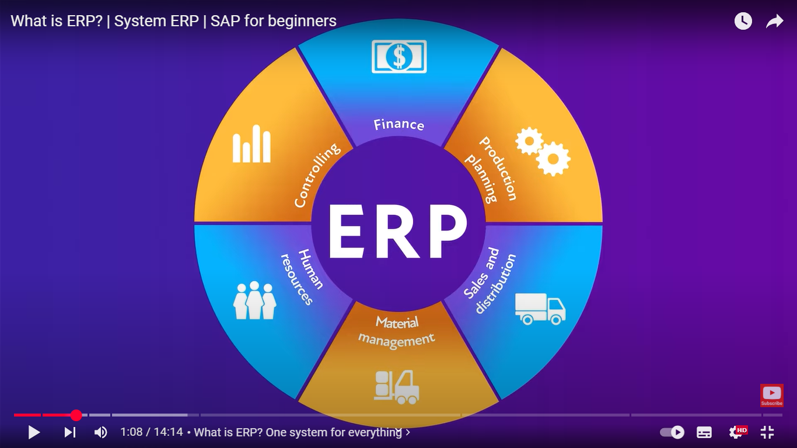
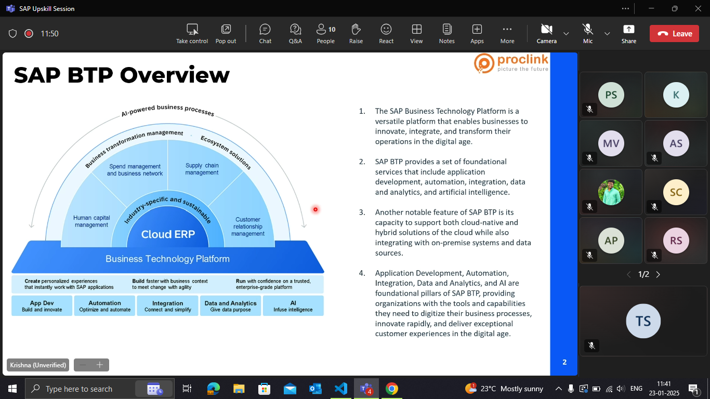
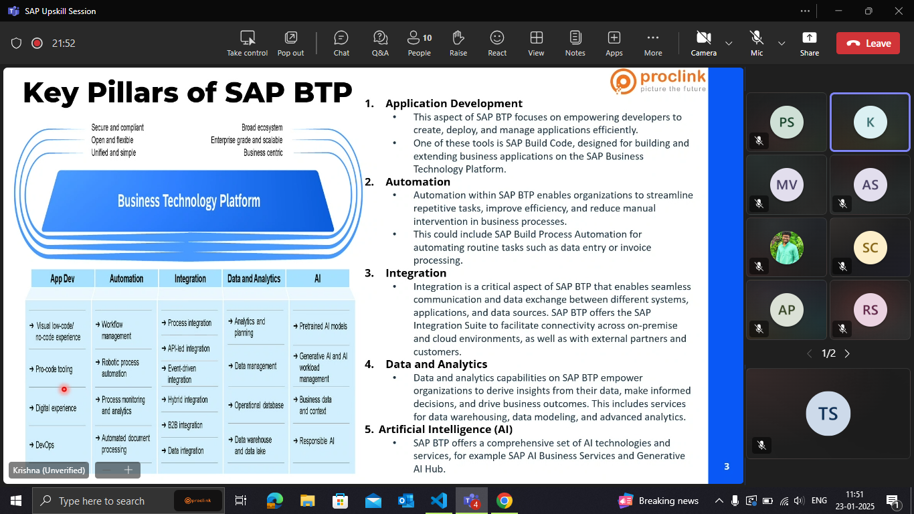

## SAP 

- ERP(Enterprise resource planning ) :

An **ERP (Enterprise Resource Planning)** system is a software solution that integrates and manages core business processes like finance, HR, supply chain, and manufacturing in a unified platform. It enables data sharing across departments, improving efficiency and decision-making. Popular ERPs include **SAP, Oracle, and Microsoft Dynamics**.

SAP is more promising than other ERP solutions due to its **scalability, industry-specific solutions, and strong integration capabilities**. 

## SAP BTP Cockpit 

 Through the cockpit, users can manage global accounts, create subaccounts, and organize them in a directory hierarchy. Key services available include SAP Integration Suite, which supports hybrid integrations, and SAP Build Code for low-code and pro-code development, allowing businesses to build custom applications quickly.

SAP BTP (Business Technology Platform) Cockpit is needed for managing and developing cloud-based applications, **integrations**, and **services** within the SAP ecosystem. It provides a centralized interface.

Examples of Cloud-Based Applications:

- SAP S/4HANA Cloud – Cloud ERP for business operations.

##  Services 

- All this information is mentioned as a one stop shop. where we can find all the related info

- there r 89 services in BTP

## SAP BTP Commercial Models :

SAP Business Technology Platform (SAP BTP) offers flexible pricing models to meet different business needs. These models determine how customers consume and pay for SAP BTP services.

### **SAP BTP Commercial Models**  

SAP Business Technology Platform (**SAP BTP**) offers **flexible pricing models** to meet different business needs. These models determine how customers consume and pay for SAP BTP services. The main commercial models are:  

---

### **1. Pay-As-You-Go (PAYGO)**  
🔹 **Ideal for:** Businesses that need flexibility and want to start small.  
🔹 **How It Works:**  
- No upfront commitment.  
- Pay only for the services you use.  
- Best for experimentation, prototyping, or unpredictable workloads.  
🔹 **Example:** If you use only SAP Integration Suite for a short period, you pay only for that usage.  

---

### **2. Cloud Platform Enterprise Agreement (CPEA)**  
🔹 **Ideal for:** Enterprises with predictable usage who want volume discounts.  
🔹 **How It Works:**  
- Pre-purchase credits based on expected service usage.  
- Credits can be used across multiple SAP BTP services.  
- More cost-effective than PAYGO for regular users.  
🔹 **Example:** A company purchasing $100,000 worth of credits can use them for databases, AI, or integration tools within SAP BTP.  

---

### **3. Subscription Model**  
🔹 **Ideal for:** Businesses that need specific services for a fixed duration.  
🔹 **How It Works:**  
- Pay a fixed price for a predefined set of SAP BTP services.  
- Contract-based (e.g., 1-year, 3-year subscription).  
- Good for businesses needing stable, long-term solutions.  
🔹 **Example:** A company subscribes to **SAP Integration Suite** for a fixed fee annually.  

---
