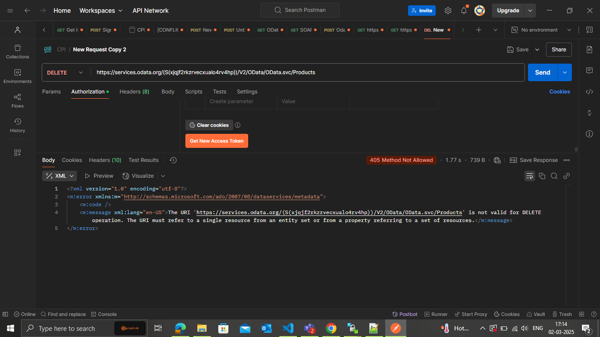

The "Bad Request" (400) error in your OData batch request is caused by the message:

"There are too many entities in the target set. Please start a new session and try again."

This typically means that your request is trying to process too many entities in one batch, exceeding the OData service's limit. Here’s what could be causing this issue and how you can resolve it:

