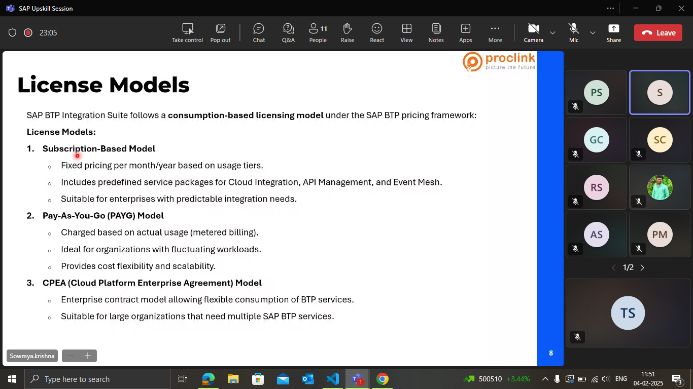
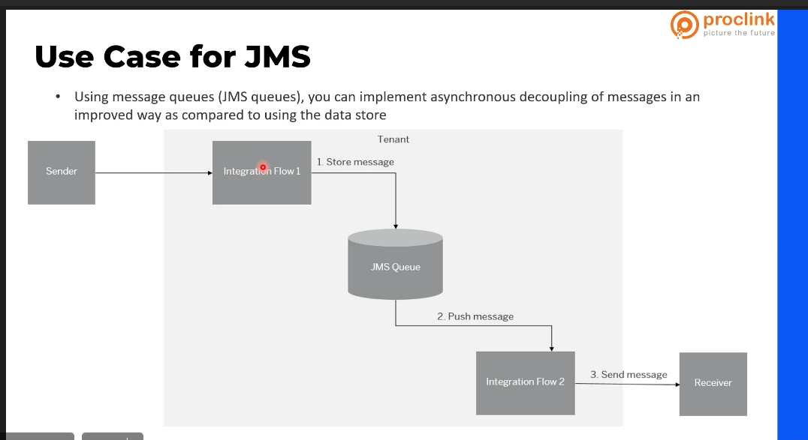
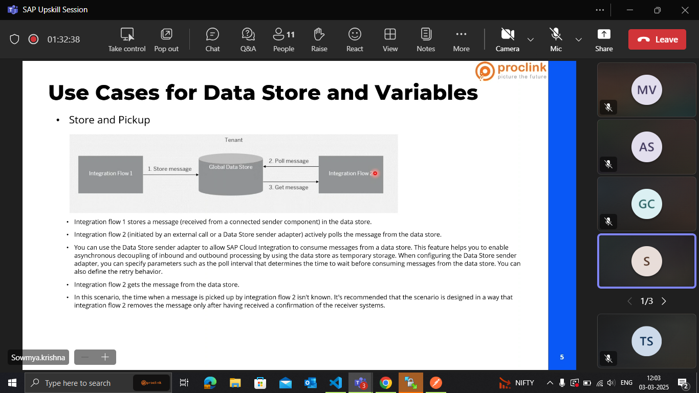

(img1)

(img2)

-----23-01-2025

## SAP BTP Overview
reports means business warehouse 

forms ,workflows ,configurations are within technologies.

- BTP(Business technology platform) is a unified cloud based platform.

- cloud version of pipo is BTP integration suite.

Set of foundational services:
1. Development (ide enironment) we need a host an application
2. Automation
3. Integration 

- SAP BTP is HYbrid i.e it can connect with cloud systems and also integrate with on-premise systems.

### App Dev :

- low-code / no code : Achiving our business functionallity with low coding or no coding.

- Pro-code tooling: SAP build code , using this we can create new apps using python, java, node.js

### Automation :
- Workflow :  we can create custom workflows in btp 

- Robotic process Automation : when we what to do automation using UI screen then it is called robotic process automation. we need to write some technical codes to work on iyt 

- automation document processing :

### Integration :

PIPO + cloud --> hybrid integration

business to business integration ---> BCB integration

### DAta Analytics :
- sap btp works to derive insights from their data.
Managing the data.

### AI :

Zole(for SAP) is like a copilot for microsoft.
where we can create chatbot agents , prepare trained models.

# SAP BTP commercial Models :

Explained about BTP ...
we have free tier and subscription models. 

## aspects :

- flexibility 
- cost control 
- best for
 

1. Pay AS You Go : we will use as much as we want and at the end of the moth we get a invoice  and we need to pay.

2. Cloud platform Enterprsie Agreement(CPEA):
- Middle to large org with predictable usage patterns. 

- pre commited spending model 
- It is good for large business 
- it contains few agrement terms.
- Discounts are available for large commitments

# 24-01-2025

## SAP BTP COOKPIT

Services 

- All this information is mentioned as a one stop shop. where we can find all the related info

- there r 89 services in BTP

- trial version is different from free tier .. the free tier is only  available when we choose a commercial model pay as u go or subscription model.

service - SAP BTP ABAP environment.
(it is a service )
we check wheather free tier is available or not. 
overview , pricing, related 

service - develop a full time application using RAP
overview, project board, related missions .

SAP integration suite

pricing - subscription amount per month.
can make hybrid integration

(This is called a cockpit)
- BTP provides various like handling integration suite , data analysis, working on workflows, CAP dev , RAP dev 

## About the BTP cockpit 

- Global account is only provided to few people in the org.

SAP Build Code helps in getting started with CAp , RAP applications.

gone through the left side pallete
- resource providers 
- boosters 
- System landscapes 
- we get entitlements based on the credits available in CAP 

--

creating a subaccount in global account .

- in real time we need to follow few naming standards .

## In the subaccount 

- we created an another subaccount  other than trial ... so the integration is not enabled in the new dev subaccount. so to get integration suite we need to get more credits ....(credits?)

- We create a Integration suite. 

created dev and added entitlements for that sub acount .

## 27-01-2025
 
### SAP BTP Cockpit 
- we will either use a subscription model or a free trial or an trail account

- How to handle multiple global accounts. 

sub accounts are to logically separate and provide isolation . 

### Directory 

- it organizes the subaccounts into hierarchy(upto 7 levels)

- subaccounts can also directly come under global account.

### Entitlements 

- service plans that u entitled to use .

- this shows the booked service plans available in your BTP global account.

### Subaccount 

- region assignment doesnt have to depend on u r location. like if u r location is india subaccount can be US. 

- creating a subaccount --> since it is a trail account we got only 2 cloud providers.

- in the subaccount as a region we choose singapore and set the environment as cloud fountary. 

- we created two different sub accounts (for pankaj and micheal)

- We moved the integration Suite frm one directory to another.(we will select a new parent while moving)

- We arrange the directories for better visual understanding .

# Environment 

runtime - cloud fountary(open source  application ), kyma,ABAP environments.

- Cloud fountry is for CAP sevices

- when we r trying to build any microservices we use kyma.

- ABAP env 

- it have restrictions
- it is mostly recommended when we r using RAP as a backend. 

# Services

we created an instance and we created a service key.

- it contains the imp capabilities. 

- Since it is a trail account we have only limited quota.  

So we can only use 1 Integration suite  for a suvb account.

## 28-01-2025

- API Management 
Normally, when we have 10 api fetches in that 4 fetches are from one API , and other4 are from 1 API remaing 2 from other there are 3 different API's .

But here in API management, we will write 1 api( This is the main API) that internally connect with other three API's.

- Trading partner Management.

- OData Provisioning 

- Open Connectors: There will be lot of connectors in integration Suite. 

- Integration Assessment: 

- Migration Assessment :PIPO, Feasability Analysis

## TO work on CAP or RAP we need to subscribe for SAP build Code. 

we tried to add  build code Application  into our tenent. 
- checked the sap Build code in the entitlements.

- we have seen the lobby for build code where we can create codes

---

development configuration :

- SAP Fiori Application
- Full- Stack Application 
- Mobile Application 

# SAP Build 

## Lobby :

This is Like a Dashboard and can  get overview of applications where the developer can manage and see the applications.

This Lobby canalso provide notifications, team collaborations.

## Store :

This is  Similar to a repositary

## About SAP Build Code

- SAP BUild Code is a low code development platform . That allows us to develop custom applications quickly and easily.

Using SAP we can drag and drop pre-build components, connect data sources and create workflows to build Applications.

## 29-01-2025

- created a buil nd created a project in it. 

it is get started with business studio 

build code is started  in the recent times.

- Gen AI in integration Suite helps us in developing integration flows more on groovy scripts. 

- before build code .. to create a fiori app we need to get the entitlements. 

- cloud version of vs code -> SAP Business application Studio. 

- firstly Build code is for CAP letter it is suitable for RAP too.

## SAP HANA Cloud 

- can use for anytype of data.(structured, un structured, semi structured)

cosmos DB Can hold any kind of Data.

## 30-01-2025

# Interfaces 

recap of fit to standard gap Analysis 

interfaces - coz the source and target are different and we need a middleware.

ex : source is SAP 
target is ICICI Bank 

### life cycle of interface 

- functional consaltant explains the process of the project .

## Design : 
once we are clear abt the requirement , we will make a technical design. 

we will be asking the target for all the info regarding the integration. 

like ,
do we need to upload the payload to azure, Does API's Available. 

## Build: 
here we develop the SAP programs , configuring the middleware .

## Error HAndling:

perform validations , find errors and think wheather the errors can be handled or not. 

## Testing :

security checks are done and will perform few checkings.

- this is almost similar to sdlc life cycle ins/w development.

real-time : the data should flow simultaneously when shen sending from source to target. 

- Data format & protocol : IDoc is only used when Source and target is sap only. 

- Security is provided by using pgp keys.

## About integration pattern 

- API based integration is like dealing with real time , it also provides security

- Event driven architecture is more popular , it is similar to real-time plug-in and plug out and is also reusable . 

But event driven is complex 

- Filebased integration: data exchanged in a structured format . 

But error handling is difficult 

## Build 

in the design we have set all the requirements ,like what api we willuse and about the integration suite. 

At the end of a process we will raise a TR to deploy the work to QA

- sap btp admin imports the TR to QA

(the functional team takes care of testing)

## Integration Suite 

SAP Integration Suite is used to connect applications, processes, and data across different systems

it can connect with SAP to SAP and SAP to Non-SAP

1. Multiple Integration Styles

Supports different integration patterns, including:

- Cloud Integration (Process Integration): For A2A and B2B integrations.
- API Management: To create, expose, and monitor APIs securely.
- Event Mesh: For real-time event-driven architecture.
- Open Connectors: Simplifies connectivity with third-party applications

2. Seamless Integration Between Systems

Connects SAP and non-SAP applications, both on-premise and in the cloud.
Supports APIs, events, and batch processes for different integration scenarios.

- b/w two non sap products we r not recommended to use sap btp .

Hybrid integration cap : we can work with PIPO additional pipe lines.

- we dont need to  write much code ... we will mention codes in groovy. 

### SAP Graph : it itself is a capability and a topic

Odata provisioning : it replaces  net waver gateway

Connecting Suppliers & Vendors
📌 Scenario: A manufacturing company orders raw materials from multiple vendors.
🔹 Use Case: Integration Suite helps:

Automatically exchange purchase orders, invoices, and shipment updates with suppliers.
Ensure smooth supply chain management with real-time updates.

## 04-02-2025

- CI we will use extensively in our development.
- Event Mesh (It is a event driven architecture)

- Integration Assesment is used to assesst our strategy. 

- btp integration suite can work with ECC, It ca talk to SAP , non -SAP and SaaS products. 
- integration suite is mostly pattern related.
- security & Compilance : OAuth or BAsic in the Authentication. 

(one of the above models should be there to use intrgration Suite)

(the below artifacts are workflows which are accessible but are immutable)

- We created a package in integration Suite. 
and inside the integration suite we create artifacts.

value Mapping : source one name is mapped to other name in the destination.
API 
data types and msg types are used in message mapping . 

## Graph

- Graph is a place where we can explore more about our data graph.
- B2B Scenarios : trading partner management.

Custom type systems : we will use custom type msgs for the SOAP req kind of work 

configure is where we configure our API's .

MIG : describes the structure  of a customized interface
MAG: specifies mapping  b/w source and target

(Key store , the OAuth2 Authentication code is used more)

- Analyze : it checks the health of the instances and other processing functionality.

the integration leader or the integration architect looks into the designs. 

Maintaining the access policies - restricting the unauthorized users. 

- custom roles : it is more important becoz the person who is eligible to use this can only use the application. 

- Overview and test connectivity we have gone through at end.

### Tmrw : cloud integration , workflow.

## 05-02-2025 

- ABout the downloading the artifacts and packages. 
- TMS service is responsible for import and exports of the integration flows.

About the artifacts : it defines integration logic

- iflow : graphical rep of integration process 

- message Mapping : converts data from one format to another format  using predefined functions .

- value Mapping : replaces values dynamically b/w source and target .

- Adapters : prebuilt connectors. 

- API : Supports API exposure  through REST and SOAP protocols.

- data type : defined structured data format .

- Message type : describes the structure of message . 

### Question :
(Can we modify the artifacts. There will be 2 types They are editable andconfigure-only.)

(iflow example)

- IDOC or SOAP is the real time considering part. 

# 10-02-2025

(Cloud integration and API management)

## Cloud Integration 

- Different types of Adapters.

Non -SAP Application -> we can publish using HTTPS, SOAP 

(about the assignmennt of the roles)

(we check in the instance 2 diff segments of micheal and affrudin) from this we will create the service keys and takes the authorization.

# 11-02-2025 

Solved the problems faced on 10th 
(written in note )

# 12-05-2025 

## PGP Encryptor

# 13-02-2025

doubts on encrypter and decrypter 

(About signatures and algorithms )

# 14-02-2025

Message mapping , script collection , routing 

exception handling

# 17-02-2025 

about the problems faced on exception handling , explaining the adapters and pallete functions

sevice now and splunk trail account

# 18-02-2025 

# SOAP UI

source and destination can either be sap or non sap

Ex: Journal API 

for this there are no REST API's there are few odata APIS but no authorization to post. In this scenario we use SOAP.

# 24 -02 - 2025 

(ODATA with  post operation)

3- Q/A
4- Interview (Mock)

##  SOAP 

Message mapping is used to deal with the custom mapping like XML to WSDL

URL are only created to HTTPS, SOAP, AS2

sandbox only allows apikey

## Sandbox only supports get operations

Post

# 27-02-2025

# Data Stores 

when creating 48 duplicates we can override the file. 

# 03-03-2025 

## Data Stores 

s4 hana public cloud-->source
get coupa oauth bearer token--> then get coupa suplier number-->get coupa supplier remittance--->post
supplier to Coupa--->iflow execution completed.
get coupa oauth bearer token--> no need of new token everytime

(Write)
 

 - Data stores are not recommended for high volume .
 ## Error Handling 

 error monitoring-->we get a chance to get in emails or IFlow monitoring
error notification---> in exception handling we have used mail adpter, to notify it.
or logging to service now, or
 
error handling---> what is the error, what is the route cause, how should i hold the msg for, im i moving to jms.

error reprocess--->a system designed to automatically retry processing data that previously failed due to an error

sender- s4 hana 
iflow1 - publisher/ dumps the data
JMS queue- look ups the msg  
iflow2- Subscriber 

### The JMS Queues 

(Where used)

How to determine no: of  Queues are requird?

### Variables which has visibility for particular IFlows

--- 

Both the Iflows are de-coupling . 
They doesnt depend on each other . 

